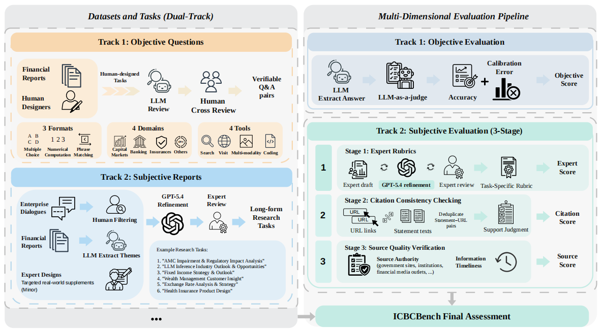

<h1 align="center">ICBCBench: An Industry Consortium Benchmark for Financial Deep Research</h1>

<div align="center">
<a href="https://arxiv.org/abs/2606.17458" target="_blank"></a>
<a href="https://huggingface.co/datasets/DeepFin-Intelligence/ICBCBench"></a>
<a href="https://huggingface.co/spaces/DeepFin-Intelligence/ICBCBench-Leaderboard"></a>
<a href="https://github.com/DeepFin-Intelligence/ICBCBench/blob/main/LICENSE"></a>
</div>


## Overview

ICBCBench is an industry consortium benchmark for evaluating financial Deep Research Agents in real-world research scenarios. It consists of bilingual objective and subjective tasks across major financial sectors, including capital markets, banking, insurance, and related financial services. Developed with over 50 contributors from more than 40 financial and academic organizations, ICBCBench combines verifiable question answering with expert-aligned long-form report evaluation to assess retrieval–reasoning accuracy, factual grounding, citation reliability, and end-to-end report quality.


 <p align="center">
  
</p>


## Directory Structure

```
evaluation_toolkit/
├── objective_eval/                 # Objective question evaluation
│   ├── predict.py                      # Generate model predictions
│   ├── judge.py                        # Judge model answers
│   └── metrics.py                      # Compute Accuracy / Calibration Error
├── subjective_eval/                # Subjective research report evaluation
│   ├── write.py                        # Generate research reports with models
│   ├── ExpertCriteria/                 # Expert-criteria based scoring
│   │   ├── score_by_criteria.py        # Score reports by criteria
│   │   └── stat.py                     # Aggregate jsonl scores to leaderboard CSV
│   ├── FACT/                           # Citation extraction, deduplication, scraping, validation, and scoring
│   │   ├── extract.py
│   │   ├── deduplicate.py
│   │   ├── scrape.py
│   │   ├── validate.py
│   │   ├── stat.py
│   │   ├── authority.py
│   │   ├── time_decay.py
│   │   └── utils.py
│   └── scoring/                        # Final score aggregation
│       └── compute_final_score.py      # Merge ExpertCriteria + FACT into final leaderboard
├── DR_clients/                     # Deep Research model clients
├── model_clients.py                # API client collection
└── utils.py                        # JSON / PDF utilities
```

## Installation

```bash
pip install -r requirements.txt
```

> Note: `subjective_eval/FACT/scrape.py` depends on `curl_cffi`.

## Environment Variables

API keys are loaded from a `.env` file in the project root. Copy `.env.example` to `.env` and fill in the required keys:

```bash
cp .env.example .env
```

Current clients use `OPENROUTER_API_KEY` as the default. Refer to `model_clients.py` and `.env.example` for all supported keys.

## Data Paths

Default data files are expected under the project root:

- Objective questions: `data/objective_questions_public_80.json`
- Subjective questions: `data/subjective_questions_public_40.json`

Generated evaluation results are written to `eval_result/`:

- Model reports: `eval_result/subjective_eval/dr_reports/reports_<model>.json`
- Objective predictions: `eval_result/objective_eval/prediction_results/<model>.json`
- Objective judged results: `eval_result/objective_eval/judged_results/judge_<judge>/judged_<model>.json`
- Objective metrics: `eval_result/objective_eval/evaluation_results.csv`
- Subjective scores: `eval_result/subjective_eval/scores/judge_<judge>/scores_<model>.jsonl`
- Subjective leaderboard: `eval_result/subjective_eval/scores/judge_<judge>/leaderboard.csv`
- FACT results: `eval_result/subjective_eval/fact_result.csv`
- Final leaderboard: `eval_result/subjective_eval/final_leaderboard.csv`

## Objective Evaluation Pipeline

### 1. Generate Predictions

```bash
python evaluation_toolkit/objective_eval/predict.py \
    --local_dataset data/objective_questions_public_80.json \
    --model gpt-4o \
    --num_workers 2
```

Outputs: `eval_result/objective_eval/prediction_results/gpt-4o.json`

### 2. Judge Predictions

```bash
python evaluation_toolkit/objective_eval/judge.py \
    --local_dataset data/objective_questions_public_80.json \
    --predictions eval_result/objective_eval/prediction_results/gpt-4o.json \
    --judge gpt-5.4 \
    --num_workers 5
```

Outputs:
- `eval_result/objective_eval/judged_results/judge_<judge>/judged_gpt-4o.json`
- `eval_result/objective_eval/evaluation_results.csv`

### 3. Compute Metrics

```bash
python evaluation_toolkit/objective_eval/metrics.py
```

Reads judged results from `eval_result/objective_eval/judged_results/judge_<judge>/` and writes metrics to `eval_result/objective_eval/`.

## Subjective Evaluation Pipeline

### 1. Generate Reports

```bash
python evaluation_toolkit/subjective_eval/write.py \
    --local_dataset data/subjective_questions_public_40.json \
    --model gpt-4o \
    --num_workers 2
```

Outputs: `eval_result/subjective_eval/dr_reports/reports_gpt-4o.json`

### 2. ExpertCriteria Scoring

```bash
python evaluation_toolkit/subjective_eval/ExpertCriteria/score_by_criteria.py \
    --judge gemini-3.1-pro \
    --report_model gpt-4o
```

Outputs: `eval_result/subjective_eval/scores/judge_<judge>/scores_gpt-4o.jsonl`

### 3. Aggregate ExpertCriteria Scores

```bash
python evaluation_toolkit/subjective_eval/ExpertCriteria/stat.py \
    --input_dir eval_result/subjective_eval/scores/judge_<judge> \
    --query_file data/subjective_questions_public_40.json \
    --output_csv eval_result/subjective_eval/scores/judge_<judge>/leaderboard.csv
```

### 4. FACT Evaluation

Run the FACT pipeline (`extract.py`, `deduplicate.py`, `scrape.py`, `validate.py`) to produce a validated citation file, then compute FACT metrics:

```bash
python evaluation_toolkit/subjective_eval/FACT/stat.py \
    --model_name gpt-4o \
    --input_path <path_to_validated_data.jsonl> \
    --output_csv eval_result/subjective_eval/fact_result.csv \
    --query_file data/subjective_questions_public_40.json
```

### 5. Compute Final Score

```bash
python evaluation_toolkit/subjective_eval/scoring/compute_final_score.py \
    --expert_dirs eval_result/subjective_eval/scores/judge_<judge> \
    --fact_csv eval_result/subjective_eval/fact_result.csv \
    --output_dir eval_result/subjective_eval \
    --alpha 0.8 --beta 0.1 --gamma 0.1
```

Outputs: `eval_result/subjective_eval/final_leaderboard.csv`

The final score formula is:

```
S_final = alpha * S_expert + beta * S_citation + gamma * S_source
```

## Notes

- All scripts can be run directly or as modules (`python -m evaluation_toolkit.objective_eval.predict ...`).
- Use `--max_samples` to limit the number of samples during testing.
- Set `--num_workers` / `--max_workers` according to your API rate limit.
- The FACT pipeline expects `citations_deduped` in the input data with fields such as `facts`, `validate_res`, `publish_time`, and `true_url`.


## Contact

For questions or feedback about ICBCBench, please contact:

- **Weiya Li**: [weiyali126@outlook.com](mailto:weiyali126@outlook.com)
- **Zhiwei Tang**: [zwtang1220@gmail.com](mailto:zwtang1220@gmail.com)
- **Yizhou He**: [jonah_he@163.com](mailto:jonah_he@163.com)
- **Li Guo**: [guo_li@fudan.edu.cn](mailto:guo_li@fudan.edu.cn)
- **Linfeng Zhang**: [zhanglinfeng@sjtu.edu.cn](mailto:zhanglinfeng@sjtu.edu.cn)

## Citation

```bibtex
@misc{li2026icbcbenchindustryconsortiumbenchmark,
      title={ICBCBench: An Industry Consortium Benchmark for Financial Deep Research}, 
      author={Weiya Li and Zhiwei Tang and Yizhou He and Chenghao Wang and Liang Feng and Xiao Sun and Dongrui Liu and Zichen Wen and Hu Wei and Jinghang Wang and Yi Luo and Li Guo and Linfeng Zhang},
      year={2026},
      eprint={2606.17458},
      archivePrefix={arXiv},
      primaryClass={cs.CE},
      url={https://arxiv.org/abs/2606.17458}, 
}
``` 